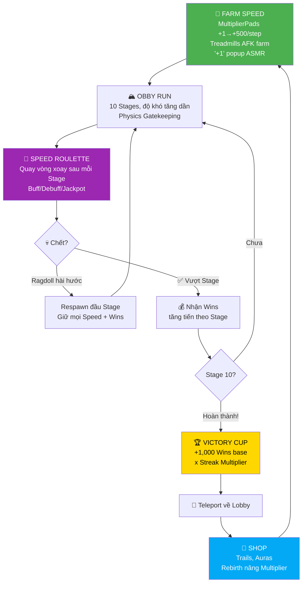

# 🎮 GAME DESIGN DOCUMENT v2 — +1 Speed Escape (Definitive Edition)

> **Tên game:** +1 Speed Escape  
> **Engine:** Roblox (Luau)  
> **Thể loại:** Speed Simulator + Obby Hybrid  
> **Target:** Gen Alpha / Gen Z (8-16 tuổi)  
> **Platforms:** PC, Mobile, Console  
> **Art Style:** Stud Texture + Checkerboard Pattern (ô vuông bàn cờ)  
> **Max Level World 1:** 120  

---

## 📋 MỤC LỤC

1. [Tổng Quan Gameplay](#-1-tổng-quan-gameplay)
2. [Cơ Chế Signature — "Speed Roulette" & "Server Boost"](#-2-cơ-chế-signature--speed-roulette--server-boost)
3. [Core Loop Chi Tiết](#-3-core-loop-chi-tiết)
4. [Thiết Kế 10 Stage (World 1 — GrassLand)](#-4-thiết-kế-10-stage-world-1--grassland)
5. [Hệ Thống Kinh Tế & Nâng Cấp](#-5-hệ-thống-kinh-tế--nâng-cấp)
6. [Công Thức Toán Học & Game Balance](#-6-công-thức-toán-học--game-balance)
7. [Monetization Strategy](#-7-monetization-strategy)
8. [Retention & Addiction Systems](#-8-retention--addiction-systems)
9. [Viral & Social Systems](#-9-viral--social-systems)
10. [Roadmap — Multi-World Expansion](#-10-roadmap--multi-world-expansion)

---

## 🎯 1. TỔNG QUAN GAMEPLAY

### Triết lý thiết kế
Game gốc "+1 Speed Escape Keyboard" cực kỳ thành công nhờ 3 yếu tố: **ASMR thỏa mãn** (tiếng phím bấm liên tục), **con số tăng vọt** (+1, +50, +500), và **obby vui nhộn**. Game của chúng ta sẽ GIỮ NGUYÊN cốt lõi đó nhưng thêm **2 cơ chế signature chưa ai có** để tạo bản sắc riêng.

### Art Style — Stud Checkerboard
Phong cách nghệ thuật chủ đạo của game:
- **Material:** `Studs` (mặt Part full texture stud nổi)
- **Pattern:** Ô vuông bàn cờ (Checkerboard) — xen kẽ 2 tone màu sáng/tối
- **World 1 GrassLand:** Xanh lá đậm `#2D8B47` xen kẽ xanh lá nhạt `#3DAF5C`, tường/rào trắng-xanh nhạt
- **Vibe:** Retro Roblox Classic, sạch sẽ, tối giản nhưng đẹp mắt với các khối hình học Neon làm điểm nhấn

### Vòng lặp cốt lõi (30 giây)
```
👟 Bước trên MultiplierPad → "+1" bay lên liên tục → Lên Level → Chạy Nhanh Hơn
→ Vào Obby 10 Stage → Vượt bẫy bằng KỸ NĂNG + TỐC ĐỘ → Nhận Wins
→ Quay Lobby → Mua Upgrade → Lặp lại
```

### 4 giai đoạn chơi
1. **FARM** — Đi bộ trên MultiplierPads để cày Speed, lên Level.
2. **RUN** — Vượt 10 Stage Obby với cơ chế bẫy tăng dần. Physics Gatekeeping đảm bảo phải đủ Level mới qua.
3. **SPIN** — Cơ chế signature "Speed Roulette": Mỗi lần vượt xong 1 Stage, quay vòng xoay ngẫu nhiên nhận buff/debuff ngắn hạn cho Stage tiếp theo.
4. **COLLECT** — Thu thập Wins mua Trails, Auras. Rebirth để nhân hệ số vĩnh viễn.

---

## 🎰 2. CƠ CHẾ SIGNATURE — "SPEED ROULETTE" & "SERVER BOOST"

### Vấn đề: Game giống copy
Game "+1 Speed" hiện tại không thiếu trên Roblox. Nếu chỉ có obby + farm thì không có lý do người chơi chọn game BẠN thay vì game GỐC.

---

### Signature #1: Speed Roulette — Vòng Xoay May Rủi Giữa Các Stage

**Cơ chế:** Mỗi khi người chơi vượt qua 1 Stage, TRƯỚC KHI bước vào Stage tiếp theo, một **vòng xoay cực đẹp** xuất hiện trên màn hình. Người chơi BẮT BUỘC quay 1 lần (miễn phí). Kết quả sẽ ảnh hưởng đến Stage tiếp theo:

| Xác suất | Kết quả | Hiệu ứng | Ví dụ |
|:-:|:---|:---|:---|
| 35% | 🟢 **BUFF Speed** | WalkSpeed +20% trong Stage tiếp theo | Dễ vượt hơn, cảm giác sướng |
| 20% | 🟡 **x2 Wins** | Nhân đôi Wins nhận được từ Stage tiếp | Thỏa mãn, muốn chạy tiếp |
| 15% | 🔵 **Shield** | Miễn nhiễm 1 lần chết trong Stage tiếp | Cực kỳ quý giá ở stage khó |
| 10% | 🟣 **MEGA BUFF** | WalkSpeed +50% + x3 Wins | Jackpot cảm giác vô đối |
| 10% | 🔴 **DEBUFF Speed** | WalkSpeed -15% trong Stage tiếp | Tăng thử thách, thú vị |
| 5% | ⚫ **Scramble** | Đảo ngược điều khiển trái/phải 5 giây | Hài hước, viral clip |
| 5% | 💎 **JACKPOT** | x10 Wins + Golden Aura tạm thời | Cực hiếm, la hét "OMG" |

**Tại sao đây là Signature?**
1. **Chưa game speed simulator nào có.** Đây là điểm bán hàng duy nhất (USP).
2. **Gây nghiện cực mạnh:** Variable ratio reinforcement — cùng cơ chế tâm lý của slot machine.
3. **Tạo khoảnh khắc viral:** Khi ai đó quay trúng JACKPOT x10 → la hét → record → đăng TikTok/YouTube.
4. **Monetization tự nhiên:** Bán gamepass "Extra Spin" (quay thêm 1 lần, chọn kết quả tốt hơn).

---

### Signature #2: Server Boost — Mua Buff Cho CẢ SERVER

**Cơ chế:** Bất kỳ người chơi nào đều có thể bỏ Robux mua **Server Boost** — một buff khổng lồ áp dụng cho TẤT CẢ mọi người trong server, kéo dài 10 phút.

| Boost | Giá (Robux) | Hiệu ứng | Thời gian |
|:---|:---:|:---|:---:|
| ⚡ **Server x2 Speed** | 49 R | Tất cả player trong server nhận x2 Speed gain | 10 phút |
| 🏆 **Server x2 Wins** | 49 R | Tất cả player trong server nhận x2 Wins | 10 phút |
| 💫 **Server MEGA Boost** | 99 R | x2 Speed + x2 Wins cho toàn server | 10 phút |

**Khi Server Boost được kích hoạt:**
1. **Thông báo toàn server:** `🎉 [TênNgườiMua] vừa kích hoạt SERVER x2 SPEED cho cả server! (10 phút)`
2. **Hiệu ứng visual:** Banner phát sáng ở góc trên màn hình tất cả player, đếm ngược.
3. **Tất cả player đều được hưởng** — không phân biệt ai mua.

**Tại sao cơ chế này KHỦNG:**
1. **Social pressure cực mạnh:** Khi 1 người mua → cả server cảm ơn ầm ĩ → người mua cảm thấy sướng → muốn mua tiếp. Các player khác thấy thế cũng muốn "cho đi" → mua tiếp → DOANH THU X10.
2. **Whale bait tốt nhất:** Whale thích flex, thích được "anh hùng" — cơ chế này cho phép whale flex trước cả server.
3. **Community builder:** Tạo không khí server cực vui, player muốn ở lại lâu hơn → tăng session time → tăng retention.
4. **Viral:** "OMG someone boosted the whole server!" → clip → share.
5. **Stack được:** Nhiều người mua cùng lúc = buff chồng lên = FRENZY mua sắm hàng loạt.

**Quy tắc chống lạm dụng:**
- Cooldown 2 phút giữa 2 lần mua Server Boost cùng loại.
- Buff không stack trùng loại, chỉ gia hạn thời gian.
- Chỉ hiển thị boost mới nhất trong chat, tránh spam.

---

## 🔄 3. CORE LOOP CHI TIẾT



---

## 🏗️ 4. THIẾT KẾ 10 STAGE (WORLD 1 — GRASSLAND)

### Art Style GrassLand
- **Ground:** Part `Material = Studs`, checkerboard xanh lá đậm `#2D8B47` / xanh lá nhạt `#3DAF5C`
- **Tường/Rào:** Trắng hoặc xanh nhạt `#A8E6CF`, Material = Studs
- **Bẫy/Cơ chế:** Neon đỏ/cam/tím phát sáng tạo tương phản rõ ràng
- **Hố/Void:** Nước xanh dương Cyan `#00CFFF` hoặc khoảng trống đen
- **Bầu trời:** Sáng, tươi, Skybox xanh da trời với mây trắng

### Nguyên tắc thiết kế Stage
1. **Mỗi Stage = 1 cơ chế bẫy duy nhất.** Không trộn lẫn. Người chơi phải MASTER cơ chế đó.
2. **Dễ thiết kế, khó master.** Dùng Part cơ bản + Script đơn giản nhưng tạo trải nghiệm WOW.
3. **Speed là chìa khóa.** Mỗi Stage buộc người chơi phải ĐỦ NHANH mới qua.
4. **Mỗi Stage dài 200-400 studs** để giữ nhịp chơi gọn gàng (30-90 giây/stage nếu đủ level).
5. **Tất cả Part dùng Material = Studs** và pattern checkerboard theo phong cách game.

---

### ✅ Stage 1: "Keyboard Hop" (Lv. 1-10) — ĐÃ CÓ (Zone1)
**Cơ chế:** Bệ nhảy phím bàn phím cơ bản. Mỗi phím hơi khác kích cỡ. Khe hở giữa các phím tăng dần.
- **Gatekeeping:** Khe hở cuối rộng 18 studs → WalkSpeed < 12 không nhảy qua được.
- **Visual:** Phím bàn phím khổng lồ 3D, nhấn xuống khi player đạp lên (TweenService).
- **Âm thanh:** Tiếng "click clack" ASMR cực thỏa mãn khi đạp phím.
- **Trạng thái:** ✅ Đã có trong Workspace.Zone1

### ✅ Stage 2: "Laser Grid" (Lv. 10-20) — ĐÃ CÓ (Zone2)
**Cơ chế:** Hành lang dài, tia laser xoay quét ngang/dọc theo pattern cố định.
- **Gatekeeping:** Khoảng trống an toàn giữa 2 laser hẹp → phải chạy nhanh WalkSpeed ≥ 26 mới lách kịp.
- **Visual:** Tia laser đỏ phát sáng Neon, particle smoke khi quét qua.
- **Trạng thái:** ✅ Đã có trong Workspace.Zone2

### ✅ Stage 3: "Clashing Crushers" (Lv. 20-30) — ĐÃ CÓ (Zone3)
**Cơ chế:** 3 cặp cửa dập đôi khổng lồ đóng mở lệch pha.
- **Gatekeeping:** Hành lang dập dài 45 studs, thời gian mở 0.6s → WalkSpeed < 44 chắc chắn bị kẹp.
- **Visual:** Khối bê tông công nghiệp khổng lồ cao 32 studs, pattern checkerboard xám.
- **Trạng thái:** ✅ Đã có trong Workspace.Zone3

### ✅ Stage 4: "Boss Corridor" (Lv. 30-40) — ĐÃ CÓ (Zone4)
**Cơ chế:** NPC Boss Gorillo khổng lồ rượt đuổi từ phía sau. Đường chạy thẳng có chướng ngại vật nhỏ.
- **Gatekeeping:** Boss chạy WalkSpeed 70 → phải nhanh hơn 70 mới thoát.
- **Visual:** Boss Gorillo animation chạy đuổi, camera shake khi Boss gần.
- **Trạng thái:** ✅ Đã có trong Workspace.Zone4 + BossChaseService.luau

### ✅ Stage 5: "Conveyor Chaos" (Lv. 40-50) — ĐÃ CÓ (Zone5)
**Cơ chế:** 5 đoạn băng chuyền xen kẽ đẩy xuôi (+60 studs/s) và 2 chốt chặn đẩy ngược (-90 studs/s). Các khối hình học Neon (Cầu đỏ, Lập phương xanh, Trụ xanh lá) lăn từ cuối đường chạy về phía người chơi.
- **Gatekeeping:** WalkSpeed < 84 bị chốt chặn ngược đẩy lùi vĩnh viễn.
- **Trạng thái:** ✅ Đã có trong Workspace.Zone5 + Zone5ClientHelper.luau

---

### 🆕 Stage 6: "Shrinking Platform" (Lv. 50-60) — CẦN TẠO (Zone6)
**Ý tưởng:** Người chơi đứng trên một chuỗi 12 bệ phẳng lớn. **Mỗi bệ sẽ bắt đầu co rút (thu nhỏ dần) ngay khi player đặt chân lên.** Nếu không chạy nhanh nhảy qua bệ tiếp theo kịp thời, bệ sẽ biến mất hoàn toàn và player rơi xuống hố.

| Thông số | Giá trị |
|:---|:---|
| Kích thước bệ ban đầu | 20 x 2 x 20 studs |
| Tốc độ co rút | Từ 20 → 0 studs trong **2.5 giây** (TweenService) |
| Khoảng cách giữa bệ | 14 studs (cần WalkSpeed ≥ 106 để nhảy qua) |
| Số bệ | 12 bệ xếp zigzag |
| Material | Studs, checkerboard vàng/cam cảnh báo |

> [!NOTE]
> **Trạng thái:** Workspace đã có Zone6 Folder nhưng chưa rõ nội dung bên trong. Cần kiểm tra và hoàn thiện.

**Tại sao cuốn:**
- **Áp lực thời gian cực lớn:** Đất dưới chân đang biến mất → adrenaline cực cao.
- **Visual cực đỉnh:** Bệ co rút mượt mà kèm hiệu ứng particle bụi vỡ.
- **Dễ thiết kế:** Chỉ cần TweenService thay đổi Size của Part.

---

### ✅ Stage 7: "Gravity Collapse" (Lv. 60-70) — ĐÃ CÓ (Zone7)
**Ý tưởng:** Đường chạy kết hợp giữa **lật trọng lực (Gravity Flip)** và **đường chạy sụp đổ (Track Collapse)** hình vòng xoay Sonic và hành lang vuông.
- **Cơ chế:** Khi người chơi chạm vào bất kỳ bệ chạy nào, hệ thống sẽ kích hoạt chuỗi sụp đổ đuổi theo từ phía sau. Nếu không đạt yêu cầu, bệ sẽ sụp đổ ngay dưới chân. Các vùng lật trọng lực đảo ngược hướng di chuyển của người chơi lên trần/tường.
- **Gatekeeping:** WalkSpeed < 126 HOẶC Level < 61 sẽ làm bệ sụp đổ lập tức (không thể vượt qua). WalkSpeed ≥ 126 và Level ≥ 61 kích hoạt sụp đổ tuần tự với tốc độ 126 studs/s (độ trễ 0.8s).

| Thông số | Giá trị |
|:---|:---|
| Số bệ chạy | 131 bệ (Platform_1 đến Platform_131) |
| Chiều dài mỗi bệ | 10 studs |
| Tốc độ sụp đổ | 126 studs/s |
| Độ trễ kích hoạt | 0.8 giây |
| Điều kiện vượt qua | WalkSpeed ≥ 126 và Level ≥ 61 |
| Material | Sàn xanh lá, Tường/Trần nâu đất (Theme Grassland) |

**Tại sao cuốn:**
- **Độc đáo chưa từng có:** Kết hợp chạy lật trọng lực 360 độ kiểu Sonic với sàn sụp đổ đuổi sát nút.
- **Tính thử thách cao:** Yêu cầu người chơi kiểm soát hướng chạy cực tốt khi camera xoay góc 180 độ trong lúc mặt đất đang biến mất.
- **Visual hoành tráng:** Các mảnh sàn rơi tự do và nhạt dần kèm theo góc nhìn đảo lộn.

---

### 🆕 Stage 8: "Spinning Sweeper" (Lv. 70-80) — CẦN TẠO
**Ý tưởng:** Một đấu trường rộng với sàn kẻ ô vuông xanh lá (như trong ảnh). Ngay giữa sân là một cột trụ có gắn thanh gạt khổng lồ màu đỏ/hồng xoay tròn liên tục theo chiều kim đồng hồ. Dưới sàn có các mũi tên trắng phát sáng chỉ dẫn hướng xoay.

| Thông số | Giá trị |
|:---|:---|
| Kích thước sân | 150 x 150 studs |
| Tốc độ xoay thanh gạt | 45 độ/giây (Rất nhanh) |
| Chiều cao thanh gạt | Cao ngang nhân vật (Không thể nhảy qua, bắt buộc phải chạy né) |
| WalkSpeed tối thiểu | 152 (Level 74+) để chạy thoát khỏi tầm quét |
| Material | Sàn: Studs xanh lá xen kẽ. Thanh gạt: SmoothPlastic/Neon màu đỏ. |

**Tại sao cuốn:**
- **Cảm giác Wipeout / Fall Guys:** Lối chơi quen thuộc nhưng được đẩy lên cao trào nhờ tốc độ siêu nhanh.
- **Áp lực rượt đuổi:** Người chơi phải căn đúng nhịp (timing) để lao vào sân, sau đó cắm đầu chạy đua với thanh gạt khổng lồ đang sạt tới từ phía sau lưng.
- **Tính toán quỹ đạo:** Bắt buộc người chơi phải chạy men theo hướng mũi tên hoặc cua góc thông minh để tối ưu hóa quãng đường, không chỉ cắm đầu chạy thẳng.

---

### 🆕 Stage 9: "Mirror Maze" (Lv. 80-90) — CẦN TẠO
**Ý tưởng:** Mê cung nhỏ gọn (100x100 studs) nhưng tường bằng **kính trong suốt**. Player phải TÌM ĐƯỜNG ĐI ĐÚNG trong khi bị confuse bởi các bức tường vô hình. Mỗi 15 giây, tường mê cung XOAY 90° → đường đi thay đổi hoàn toàn.

| Thông số | Giá trị |
|:---|:---|
| Kích thước mê cung | 100 x 100 studs |
| Tường vô hình | Transparency = 0.92, CanCollide = true |
| Xoay mê cung | Mỗi 15 giây, toàn bộ tường Model:PivotTo() xoay 90° |
| Khe thoát hiểm | Khe hẹp 8 studs, cần chạy nhanh WalkSpeed ≥ 168 |
| Tổng thời gian giới hạn | 60 giây (hết giờ = reset) |
| Material | Studs cho sàn, Glass transparent cho tường |

**Tại sao cuốn:**
- **Não + Tốc độ.** Không chỉ chạy nhanh mà còn phải THÔNG MINH.
- **Mỗi lần chơi khác nhau** vì mê cung xoay.
- **Panic moment:** Khi đếm ngược "15s ROTATE!" → player hoảng loạn.

---

### 🆕 Stage 10: "The Final Sprint" (Lv. 90-100) — CẦN TẠO
**Ý tưởng:** Tổng hợp MỌI cơ chế bẫy từ Stage 1-9 trong một đường chạy liên tục dài 600 studs. Không có checkpoint. Mỗi đoạn 60 studs sử dụng 1 cơ chế bẫy cũ nhưng KHỐC LIỆT hơn. Cuối cùng là Victory Cup.

| Đoạn | Studs | Cơ chế | Khốc liệt hơn bao nhiêu |
|:---:|:---:|:---|:---|
| 1 | 0-60 | Keyboard Hop | Khe hở 24 studs |
| 2 | 60-120 | Laser Grid | 3 laser xoay đồng thời |
| 3 | 120-180 | Crushers mini | Đóng/mở nhanh x1.5 |
| 4 | 180-240 | Conveyor ngược | Lực đẩy -120 studs/s |
| 5 | 240-300 | Shrinking Platform | Co rút trong 1.5s |
| 6 | 300-360 | Gravity Flip | 4 flip liên tục |
| 7 | 360-420 | Speed or Die | Sụp đổ 180 studs/s |
| 8 | 420-480 | Mirror Maze mini | Xoay mỗi 10s |
| 9 | 480-540 | Boss Chase | Boss WalkSpeed 190 |
| 10 | 540-600 | **Victory Cup** | Pháo hoa + 1,000 Wins |

**Tại sao cuốn:**
- **Boss Rush cảm giác.** Tổng ôn tất cả kỹ năng.
- **Không checkpoint = high stakes.** Chết ở đoạn 9 = quay lại đoạn 1.
- **Cảm giác HOÀN THÀNH cực kỳ thỏa mãn** khi chạm Cup.

---

## 💰 5. HỆ THỐNG KINH TẾ & NÂNG CẤP

### A. MultiplierPads (8 cấp — Lobby)
| Pad | Speed/step | Requires Wins | Thời gian farm ước tính (F2P) |
|:---:|:---:|:---:|:---|
| 1 | +1 | Free | Ngay lập tức |
| 2 | +2 | 5 Wins | ~5 phút (chạy Stage 1-2) |
| 3 | +3 | 20 Wins | ~20 phút |
| 4 | +5 | 80 Wins | ~1 giờ |
| 5 | +50 | 500 Wins | ~4 giờ |
| 6 | +100 | 2,500 Wins | ~2 ngày casual |
| 7 | +250 | 15,000 Wins | ~1 tuần casual |
| 8 | +500 | 50,000 Wins | ~3 tuần casual |

### B. Treadmills (5 cấp — Mua bằng Robux)
| ID | Tên | Multiplier | Giá Robux | Phân tích |
|:---|:---|:---:|:---:|:---|
| `treadmill_1` | Máy Gỗ | x1 | Free | Mặc định |
| `treadmill_2` | Máy Vàng | x3 | 29 R | Giá rẻ, early whale bait |
| `treadmill_3` | Máy Xanh | x9 | 99 R | Mid-range |
| `treadmill_4` | Máy Hồng | x25 | 249 R | Dành cho committed player |
| `treadmill_5` | Máy Đỏ Admin | x100 | 499 R | Whale trap |

### C. Trails (6 cấp — Wins hoặc Robux)
| ID | Tên | Boost | Giá Wins | Giá Robux |
|:---|:---|:---:|:---:|:---:|
| `trail_green` | Green Trail | x1.5 | 500 | 19 R |
| `trail_blue` | Blue Trail | x2.0 | 1,500 | 49 R |
| `trail_purple` | Purple Trail | x3.0 | 5,000 | 99 R |
| `trail_red` | Red Trail | x4.0 | 25,000 | 139 R |
| `trail_rainbow` | Rainbow Trail | x5.0 | 100,000 | 249 R |
| `trail_galaxy` | Galaxy Trail | x10.0 | 500,000 | 389 R |

### D. Auras (5 cấp — Wins only)
| ID | Tên | Boost | Giá Wins |
|:---|:---|:---:|:---:|
| `aura_sparkle` | Sparkle Aura | x1.2 | 200 |
| `aura_fire` | Fire Aura | x1.8 | 2,000 |
| `aura_lightning` | Lightning Aura | x2.5 | 8,000 |
| `aura_void` | Void Aura | x4.5 | 40,000 |
| `aura_cosmic` | Cosmic Aura | x8.0 | 200,000 |

---

## 📊 6. CÔNG THỨC TOÁN HỌC & GAME BALANCE

### A. Công thức Speed nhận được
$$\text{Speed} = \text{PadBase} \times \text{Treadmill} \times \text{Trail} \times \text{Aura} \times \text{Rebirth} \times \text{Gamepass} \times \text{ServerBoost}$$

**Ví dụ tính toán cụ thể:**

| Scenario | Pad | Treadmill | Trail | Aura | Rebirth | GP | ServerBoost | Speed/step |
|:---|:---:|:---:|:---:|:---:|:---:|:---:|:---:|:---:|
| **Newbie F2P** | +1 | x1 | x1 | x1 | x1 | x1 | x1 | **1** |
| **Casual F2P (1h)** | +2 | x1 | x1.5 | x1.2 | x1 | x1 | x1 | **4** |
| **Grinder F2P (1 tuần)** | +50 | x1 | x3 | x2.5 | x1.5 | x1 | x1 | **563** |
| **Whale Day 1** | +5 | x100 | x1 | x1 | x1 | x8 | x1 | **4,000** |
| **Whale + Server Boost** | +5 | x100 | x1 | x1 | x1 | x8 | x2 | **8,000** |

### B. Đường cong Level

```text
RequiredXP(level) = floor(1,010,000 × 1.1584^(level - 67))
MaxWalkSpeed(level) = 6 + (level - 1) × 2
```

**Bảng tính thời gian farm cho F2P thuần túy (Pad 1, không buff):**

| Level | XP cần | Tổng XP tích lũy | Thời gian farm ước tính | WalkSpeed |
|:---:|---:|---:|:---|:---:|
| 1→2 | 62 | 62 | 22 giây | 8 |
| 5→6 | 111 | 420 | ~2.5 phút tổng | 16 |
| 10→11 | 231 | 1,200 | ~7 phút tổng | 24 |
| 20→21 | 1,006 | 8,000 | ~47 phút tổng | 44 |
| 30→31 | 4,379 | 50,000 | ~4.5 giờ tổng | 64 |
| 40→41 | 19,054 | 280,000 | ~1.5 ngày casual | 84 |
| 50→51 | 82,913 | 1,500,000 | ~1 tuần casual | 104 |
| 60→61 | 360,803 | 8,000,000 | ~3 tuần casual | 124 |
| 70→71 | 1,570,000 | 43,000,000 | ~2 tháng casual | 144 |
| 80→81 | 6,832,187 | 230,000,000 | ~5 tháng casual | 164 |
| 90→91 | 29,732,000 | 1,200,000,000 | ~1 năm casual | 184 |
| 99→100 | 111,555,000 | 5,500,000,000 | ~2 năm casual | 204 |
| 109→110 | 480,000,000 | 25,000,000,000 | ~4 năm casual | 224 |
| 119→120 | 2,463,000,000 | 120,000,000,000 | ~6+ năm casual | 244 |

> [!IMPORTANT]
> **Thiết kế cố ý:** F2P thuần túy đạt Level 50 trong ~1 tuần (đủ để trải nghiệm 5 Stage). Từ Lv.50 trở đi, tốc độ farm CHẬM ĐÁNG KỂ → đây là điểm chuyển đổi (conversion point) buộc người chơi phải:
> 1. Mua Treadmill/Trail bằng Robux để tăng tốc, HOẶC
> 2. Kiên nhẫn farm Wins mở MultiplierPad cao hơn, HOẶC
> 3. Thực hiện Rebirth để nhận multiplier vĩnh viễn.
> 
> Người nạp Treadmill x100 + Trail x10 + Gamepass x8 = nhân x8,000 lần → đạt Lv.100 trong ~3 ngày thay vì 2 năm.

### C. Rebirth System
```text
RequiredLevel(rebirths) = 50 + rebirths × 10
RebirthMultiplier(rebirths) = 1 + rebirths × 0.5
```

| Rebirth | Level cần | Multiplier trước | Multiplier sau |
|:---:|:---:|:---:|:---:|
| 0 → 1 | 50 | x1.0 | x1.5 |
| 1 → 2 | 60 | x1.5 | x2.0 |
| 2 → 3 | 70 | x2.0 | x2.5 |
| 5 → 6 | 100 | x3.5 | x4.0 |
| 10 → 11 | 150 | x6.0 | x6.5 |

### D. Stage Wins Progression
```lua
Constants.STAGE_WINS = {
    [1] = 1,      -- Keyboard Hop
    [2] = 3,      -- Laser Grid
    [3] = 8,      -- Clashing Crushers
    [4] = 15,     -- Boss Corridor
    [5] = 30,     -- Conveyor Chaos
    [6] = 60,     -- Shrinking Platform
    [7] = 120,    -- Gravity Flip
    [8] = 250,    -- Speed or Die
    [9] = 500,    -- Mirror Maze
    [10] = 1000,  -- Slime Avalanche
    [11] = 2000,  -- Highway Mayhem
    [12] = 4000,  -- Wind Tunnel
    [13] = 8000,  -- Momentum Pinball
    [14] = 15000, -- Thread the Needle
    [15] = 30000, -- Victory Cup (JACKPOT)
}
-- Tổng nếu clear cả 15 Stage: 60,954 Wins/run
```

### E. Physics Gatekeeping — Bảng tính chi tiết

| Stage | Min WalkSpeed | Min Level | Cơ chế chặn | Hậu quả nếu quá chậm |
|:---:|:---:|:---:|:---|:---|
| 1 | 14 | 5 | Khe nhảy 18 studs | Rơi hố |
| 2 | 28 | 12 | Khe laser hẹp | Bị laser thiêu |
| 3 | 42 | 19 | Hành lang dập 45 studs/0.6s | Bị kẹp chết |
| 4 | 56 | 26 | Boss chase WalkSpeed 60 | Bị Boss tóm |
| 5 | 72 | 34 | Chốt chặn -80 studs/s | Bị đẩy lùi + khối đè |
| 6 | 88 | 42 | Bệ co rút 2.5s + gap 14 studs | Bệ biến mất, rơi hố |
| 7 | 104 | 50 | Sụp đổ đuổi theo 100 studs/s | Bệ sập dưới chân |
| 8 | 122 | 59 | Thanh gạt xoay tròn cực nhanh | Bị thanh gạt quật văng |
| 9 | 140 | 68 | Khe hẹp mê cung đóng mở | Hết giờ bị reset |
| 10 | 158 | 77 | Dốc 45 độ ma sát=0 | Tuột lùi xuống dốc |
| 11 | 176 | 86 | Xe tải chạy 60 studs/s | Rơi xuống dung nham |
| 12 | 194 | 95 | Gió bão đẩy lùi -190 studs/s | Bị đẩy văng về điểm mù |
| 13 | 212 | 104 | Khoảng cách bệ nhún > 250 studs | Rơi xuống vực thẳm |
| 14 | 228 | 112 | Cưa máy xoay 90 độ/s, khe hở 0.2s | Bị nghiền nát |
| 15 | 244 | 120 | Đường chạy tổng hợp siêu tốc | Bị đào thải ngay lập tức |

---

## 💎 7. MONETIZATION STRATEGY

### A. Gamepasses (Mua 1 lần — Vĩnh viễn)
| Gamepass | Giá (Robux) | Hiệu ứng | Conversion trigger |
|:---|:---:|:---|:---|
| x2 Speed | 29 | x2 Speed gain vĩnh viễn | Khi player thấy farm chậm |
| x4 Speed | 79 | x4 Speed gain vĩnh viễn | Mid-game frustration |
| x8 Speed | 149 | x8 Speed gain vĩnh viễn | Late-game whale |
| Extra Spin | 49 | Quay Speed Roulette thêm 1 lần/stage | Khi quay trúng debuff |
| Auto-Rebirth | 99 | Tự động Rebirth khi đủ level | Convenience purchase |
| VIP | 399 | x1.5 Speed + x1.2 Wins + VIP Tag + Trail/Aura VIP | Status symbol |

### B. Developer Products (Mua nhiều lần)
| Sản phẩm | Giá | Nhận | Khi nào player mua |
|:---|:---:|:---|:---|
| 1K Wins Pack | 49 R | +1,000 Wins | Mở khóa Pad 2-4 |
| 10K Wins Pack | 149 R | +10,000 Wins | Mở Pad 5-6 |
| 100K Wins Pack | 399 R | +100,000 Wins | Mở Pad 7 + Trail |
| 1M Wins Pack | 999 R | +1,000,000 Wins | Whale endgame |
| Lucky Spin Token | 19 R | 1 Extra Roulette spin | Impulse buy |

### C. Server Boost Products (Developer Products — Mua nhiều lần)
| Boost | Giá | Hiệu ứng | Thời gian |
|:---|:---:|:---|:---:|
| ⚡ Server x2 Speed | 49 R | x2 Speed cho cả server | 10 phút |
| 🏆 Server x2 Wins | 49 R | x2 Wins cho cả server | 10 phút |
| 💫 Server MEGA Boost | 99 R | x2 Speed + x2 Wins toàn server | 10 phút |

### D. Rewarded Video Ads (FREE-TO-PLAY FRIENDLY)
Tích hợp Immersive Ads:
- **Xem quảng cáo → x2 Speed 5 phút:** Cho F2P cảm thấy được hỗ trợ.
- **Xem quảng cáo → Extra Roulette Spin:** Thay vì mua bằng Robux.
- **Xem quảng cáo → Revive 1 lần (không reset stage):** Thay vì quay lại đầu stage.

> [!TIP]
> **Revenue Mix lý tưởng cho Roblox 2026:**
> - 35% từ Gamepasses (one-time)
> - 25% từ Developer Products (recurring — Wins packs)
> - 25% từ Server Boost Products (recurring — social pressure rất mạnh)
> - 15% từ Rewarded Ads + Premium Payouts

---

## 🧲 8. RETENTION & ADDICTION SYSTEMS

### A. Daily Reward Calendar (7 ngày → reset)
| Ngày | Phần thưởng |
|:---:|:---|
| 1 | +100 Wins |
| 2 | +200 Wins |
| 3 | +500 Wins + 1 Free Roulette Token |
| 4 | +1,000 Wins |
| 5 | +2,000 Wins |
| 6 | +5,000 Wins |
| 7 | **+10,000 Wins + Exclusive Weekly Trail** |

> [!NOTE]
> Nếu bỏ lỡ 1 ngày → reset về Ngày 1. Tạo FOMO cực mạnh.

### B. Streak System
```lua
Constants.STREAK_BONUSES = {
    { streak = 3,   extraWins = 10,     label = "🔥 3 STREAK!" },
    { streak = 5,   extraWins = 50,     label = "🔥🔥 5 STREAK!" },
    { streak = 10,  extraWins = 250,    label = "💎 10 STREAK!" },
    { streak = 20,  extraWins = 1000,   label = "🌟 20 STREAK!" },
    { streak = 50,  extraWins = 10000,  label = "👑 50 STREAK! GOD!" },
    { streak = 100, extraWins = 100000, label = "🏆 100 STREAK! LEGEND!" },
}
```

### C. Limited-Time Events (Mỗi 2 tuần)
| Event | Mô tả | Duration |
|:---|:---|:---:|
| **Double Wins Weekend** | x2 tất cả Wins | 3 ngày |
| **Speed Storm** | MultiplierPad tạm thời x2 | 2 ngày |
| **Boss Rush** | Stage 4 Boss x3 khó hơn, x5 thưởng | 1 tuần |
| **World Race** | Leaderboard toàn server, Top 10 nhận thưởng lớn | 1 tuần |

---

### 📦 CÁC CƠ CHẾ TẠM ẨN (DÀNH CHO UPDATE SAU)

> [!IMPORTANT]
> Các cơ chế sau sẽ được triển khai sau khi game có lượng người chơi ổn định:

| Cơ chế | Mô tả | Điều kiện kích hoạt |
|:---|:---|:---|
| 🐾 **Pet System** | Thu thập thú cưng, buff thụ động (Speed, Wins multiplier) | Khi game đạt 500+ CCU |
| 🎫 **Season Pass** | Free Track + Premium Track (99R), claim tier mỗi ngày | Khi game đạt 1,000+ CCU |
| 🎡 **Lucky Wheel Hàng Ngày** | Quay wheel ở Lobby 1 lần/ngày, nhận Wins/buff/cosmetic | Khi game đạt 300+ CCU |

---

## 📢 9. VIRAL & SOCIAL SYSTEMS

### A. "FIRST!" Notifications
Khi một player là NGƯỜI ĐẦU TIÊN trên server vượt qua 1 Stage:
```
🎉 [PlayerName] vừa là NGƯỜI ĐẦU TIÊN vượt qua Stage 7 trên server này!
```
→ Tạo cảm giác cạnh tranh + flex.

### B. Server Boost Community (Signature #2)
- Khi có ai mua Server Boost → cả server vui → community tự nhiên hình thành.
- Player được buff miễn phí → cảm thấy biết ơn → muốn mua Server Boost lại cho server → vòng lặp mua sắm xã hội.
- Server chat bùng nổ "THANK YOU [tên]!!!" → tạo khoảnh khắc social viral.

### C. Ragdoll Death = Content Machine
Khi chết:
- Ragdoll physics hài hước (bay loạn xạ).
- Camera slow-motion 0.5 giây.
- Tiếng "BONK" vui nhộn.
→ Người chơi **tự quay clip** và đăng lên TikTok/YouTube.

### D. Leaderboard cạnh tranh
- **Top Speed:** Ai có Speed cao nhất server.
- **Top Wins:** Ai tích lũy nhiều Wins nhất.
- **Top Streak:** Chuỗi thắng dài nhất.
- **Fastest Clear:** Thời gian vượt 10 Stage nhanh nhất.

### E. Invite Rewards
Mời bạn bè vào game bằng link:
- Người mời: +500 Wins/bạn bè
- Người được mời: +200 Wins welcome bonus
- Cả 2 nhận buff x2 Speed 15 phút khi chơi cùng server

---

## 🗺️ 10. ROADMAP — MULTI-WORLD EXPANSION

### Cấu trúc Multi-World
Mỗi World = 1 theme hoàn toàn mới với:
- Level Cap tăng thêm 100
- 10 Stage mới với cơ chế bẫy HOÀN TOÀN MỚI
- MultiplierPad mới
- Trails, Auras mới
- Theme visual & âm nhạc mới

### World 1: 🌿 GrassLand (Level 1-100) — *HIỆN TẠI*
- **Theme:** Đồng cỏ xanh mát, phong cách retro Roblox classic
- **Art Style:** Material `Studs` trên mọi Part, pattern Checkerboard ô vuông bàn cờ
- **Màu chủ đạo:** Xanh lá đậm `#2D8B47` xen kẽ xanh lá nhạt `#3DAF5C`
- **Tường/Rào:** Trắng `#FFFFFF` hoặc xanh nhạt `#A8E6CF`, Material Studs
- **Bẫy:** Neon đỏ/cam/tím tạo tương phản
- **Âm nhạc:** Lo-fi chill, tiếng chim hót, gió thổi nhẹ
- **10 Stage:** Như thiết kế ở Mục 4

### World 2: 🏜️ Desert Temple (Level 101-200)
- **Theme:** Sa mạc cổ đại Ai Cập, kim tự tháp, đền thờ bí ẩn
- **Art Style:** Material Studs, checkerboard vàng cát `#D4A843` / nâu đất `#8B6914`
- **Âm nhạc:** Arabian ambient + tribal drums
- **Cơ chế Stage mới (ý tưởng):**
  - Quicksand Zones — bẫy cát lún chậm chân
  - Sandstorm Blindness — bão cát giảm tầm nhìn
  - Tomb Raiders — NPC xác ướp đuổi theo
  - Rolling Boulder — đá khổng lồ lăn xuống dốc (Indiana Jones classic)
  - Solar Beam — tia sáng mặt trời chiếu qua khe đền phản xạ

### World 3: 🌊 Ocean Abyss (Level 201-300)
- **Theme:** Đáy đại dương, san hô khổng lồ, tàu ngầm phế liệu
- **Art Style:** Material Studs, checkerboard xanh dương đậm `#1A4F7A` / xanh dương nhạt `#3A8FC2`
- **Cơ chế mới:**
  - Oxygen Timer — hết oxy = chết (phải chạm bọt khí)
  - Current Push — dòng chảy đẩy ngang
  - Jellyfish Maze — sứa phát sáng di chuyển ngẫu nhiên
  - Kraken Tentacles — xúc tu bạch tuộc quất ngang đường chạy
  - Pressure Zones — vùng áp suất cao chậm WalkSpeed

### World 4: 🌌 Space Station (Level 301-400)
- **Theme:** Trạm vũ trụ bị phá hủy, không trọng lực
- **Art Style:** Material Studs, checkerboard xám đậm `#2C2C2C` / xám nhạt `#5A5A5A`
- **Cơ chế mới:**
  - Zero-G Zones — nhảy bay xa cực nhưng khó kiểm soát
  - Airlock Rush — cửa khóa tự đóng sau N giây
  - Meteor Rain — thiên thạch rơi ngẫu nhiên
  - Laser Defense Grid — hệ thống phòng thủ tự động bắn
  - Wormhole Teleport — cổng dịch chuyển random (may rủi)

### World 5: 🌋 Volcano Core (Level 401-500)
- **Theme:** Lõi núi lửa, dung nham chảy
- **Art Style:** Material Studs, checkerboard đỏ đậm `#8B1A1A` / cam `#CC4400`
- **Cơ chế mới:**
  - Rising Lava — nham thạch dâng lên liên tục (timer)
  - Heat Zones — vùng nóng giảm HP liên tục
  - Eruption Events — mỗi 20s, núi lửa phun đá rơi ngẫu nhiên
  - Lava Bridge — cầu đá nóng chảy dần
  - Magma Geyser — vòi phun nham thạch bắn lên bất ngờ

### World 6+: 🧊 Frozen Tundra, 🍬 Candy Kingdom, 🎃 Haunted Mansion, ⚡ Cyber City...
> Mỗi World ra mắt khoảng 4-6 tuần 1 lần để giữ content fresh.

---

### Quy trình mở khóa World
```lua
Constants.WORLD_REQUIREMENTS = {
    [2] = { minLevel = 100, minRebirths = 1, minWins = 50000 },
    [3] = { minLevel = 200, minRebirths = 3, minWins = 500000 },
    [4] = { minLevel = 300, minRebirths = 5, minWins = 5000000 },
    [5] = { minLevel = 400, minRebirths = 8, minWins = 50000000 },
}
```

---

## 📌 TÓM TẮT — GAME CÓ GÌ KHÁC BIỆT SO VỚI "+1 SPEED KEYBOARD ESCAPE"?

| Yếu tố | Game Gốc | Game Của Bạn |
|:---|:---|:---|
| Core Loop | Farm → Obby → Farm | Farm → Obby → **SPIN Roulette** → Farm |
| Signature Mechanic | Không có (generic) | **Speed Roulette** + **Server Boost** |
| Stage variety | Obby cơ bản | 10 cơ chế bẫy độc lạ (Gravity Flip, Shrinking Platform, Mirror Maze...) |
| Social Monetization | Không có | **Server Boost** — mua buff cho CẢ SERVER |
| Social | Leaderboard cơ bản | Server-first notifications, Server Boost community, Invite rewards |
| Monetization | Gamepass cơ bản | **Rewarded Ads** + Server Boost + Lucky Spin Token |
| Content Update | Chậm | **Multi-World expansion** mỗi 4-6 tuần |
| Viral potential | Ragdoll trung bình | **Ragdoll slow-mo** + **Roulette JACKPOT moment** + **Gravity Flip clip** |
| Art Style | Keyboard theme | **Stud Checkerboard GrassLand** — retro nhưng đẹp |

---

> [!CAUTION]
> **LƯU Ý QUAN TRỌNG VỀ ĐẠO ĐỨC THIẾT KẾ:**
> - Không thiết kế frustration mechanics CỐ Ý (kiểu "bạn phải chết 50 lần để muốn mua revive"). Thay vào đó, để tốc độ farm tự nhiên chậm dần khiến player TỰ MUỐN nạp.
> - Rewarded Ads luôn là OPTION, không bao giờ bắt buộc.
> - Server Boost là cơ chế XÃ HỘI, không phải pay-to-win — mọi người đều hưởng.
